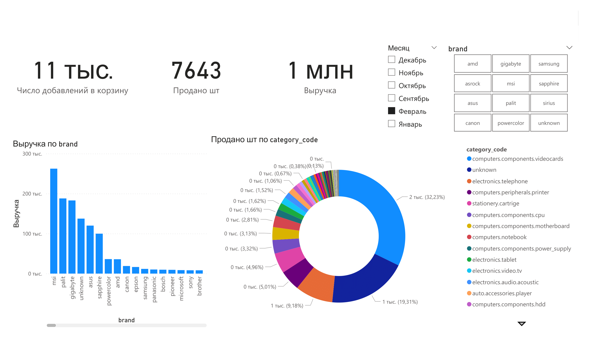

#  Electronics-Store-Events-Funnel-Analysis

Аналитический проект по исследованию событий на сайте магазина электроники за 5 месяцев. В ноутбуке проводится первичный обзор данных, предобработка, EDA, построение воронки продаж, а также анализ категорий и брендов. В результате даются рекомендации по оптимизации ассортимента, маркетинговых стратегий и повышению конверсии.

## Описание

- **Данные:** события просмотров, добавления в корзину, покупки  
- **Источник данных:**  [Kaggle: Ecommerce events history in electronics store](https://www.kaggle.com/datasets/mkechinov/ecommerce-events-history-in-electronics-store)  
- **Задачи анализа:**
> 1. Первичный обзор данных  
> 2. Предобработка и очистка  
> 3. EDA и краткий анализ  
> 4. Построение воронки продаж  
> 5. Анализ категорий и брендов

## Используемые инструменты

- Python: `pandas`, `numpy`, `matplotlib`, `seaborn`, `scipy`  
- Jupyter Notebook

## Как запустить

1. Скачайте датасет, распакуйте и убедитесь, что файл `events.csv` находится в той же директории, что и Notebook.  
2. Откройте `EcommerceEventsAnalysis.ipynb` в VS Code или Jupyter Notebook.
3. Запустите ячейки по порядку для воспроизведения анализа.

## Результаты и рекомендации

- Проведён анализ качества данных, выявлены пропуски и дубликаты  
- Выявлены выбросы по цене  
- Построена воронка продаж и рассчитаны конверсии  
- Проведён анализ по категориям и брендам  
- Даны рекомендации по оптимизации ассортимента и маркетинговых стратегий
